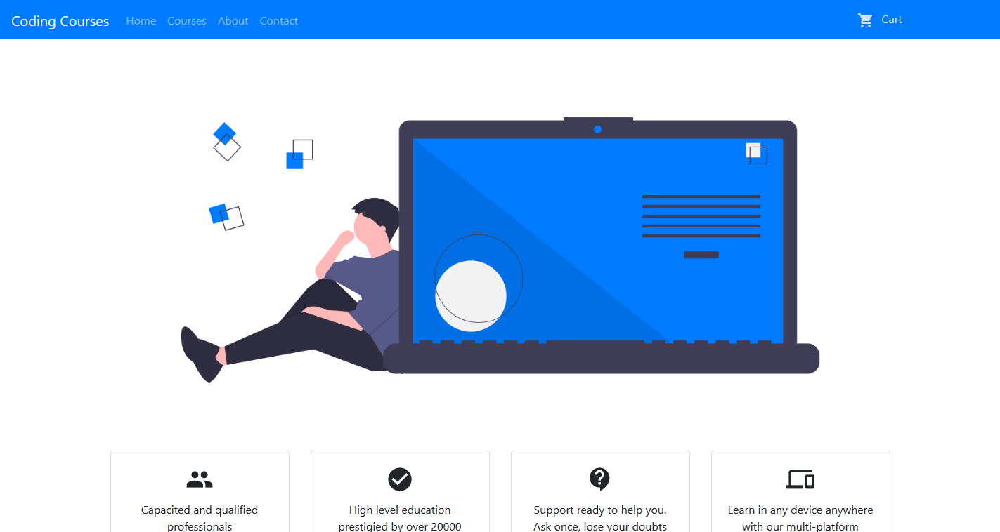
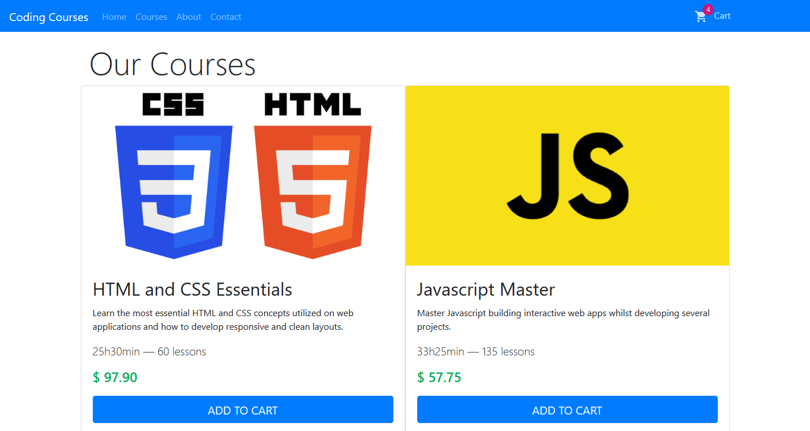
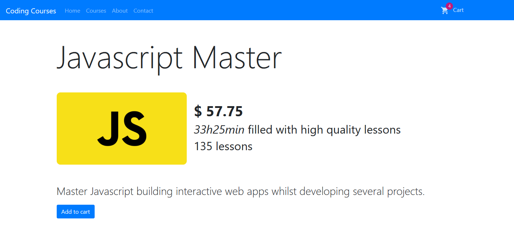

# Coding Courses Platform
In this project I got a bit more ambitious and developed something bigger than anything I've done before with React. It's a platform that emulates a real coding courses website: it has a homepage, "about", "contact" and "courses" routes.\
The courses info are obtained through a local file named "data.js".\
I may implement server-side features, such as login and database storage in the future.

## About
The focus of this application was to build something bigger with React, focusing more on the display of the data via components emulating a real application than the visual itself, that's how Bootstrap came in handy agilizing the process of stylizing the interface.

## Pages
### Home
Simple, elegant and straight-forward page with some information about the "*Coding Courses team*", vectors promoting the platform and "top courses" section.

### Courses
Page listing all the available courses on the platform.

### About
Page containing some info about the fictional team of this platform.

### Contact
Page containing fictional contacts of the web platform team.

### Cart
Page that renders all courses stored in the user's shopping cart and the total pricing of all of them. The data is stored in localStorage. Has conditional render based on wether there's at least one course on the cart. Also, it's possible to remove a course or visit its page for better information visualization.

### Course info
Page that renders the course's info based on the route parameter passed through. Ex: `/courses/javascript-master`

## Features
 - Renders dynamically the courses using React
 - Saves cart courses on LocalStorage for further processing
 - Navbar cart icon's badge updates dynamically based on amount of courses on the user's cart
 - Dynamic and interactive cart page
 - Invalid route custom page

## Technologies used

- React
- React Router
 - Material-UI icons and badge
 - Bootstrap
- [undraw.co](https://undraw.co) for the vectors
- [thispersondoesnotexist](https://thispersondoesnotexist.com) for the team members (about page)

## Installation
Clone this repository\
In the root directory of the repository run `npm install` on the command prompt.\
After all the dependencies have been installed, run `npm start` on the same directory

## Further informations
This was a nice project to develop. I'm satisfied with the results for now, and even thinking about further upgrades.\
First time using various Bootstrap functionalities and Material-UI icons that I've been wanting to use for some time.
